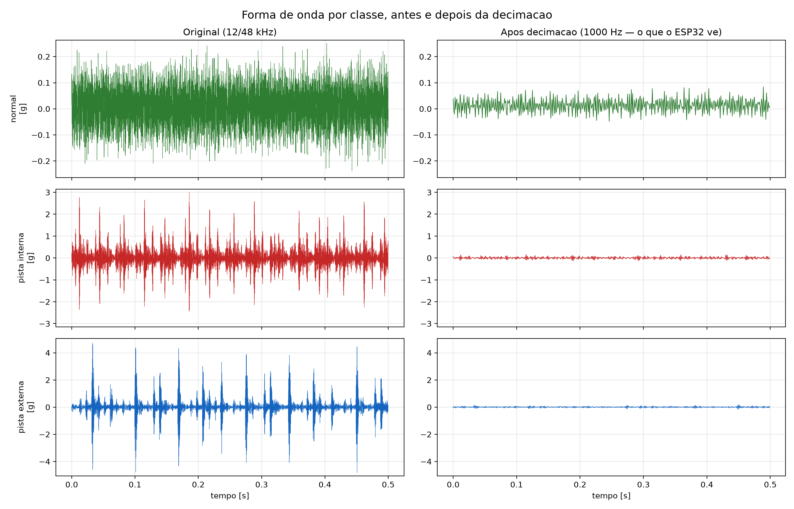
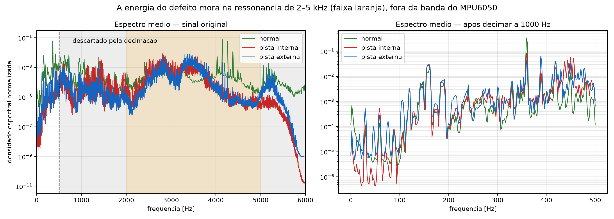
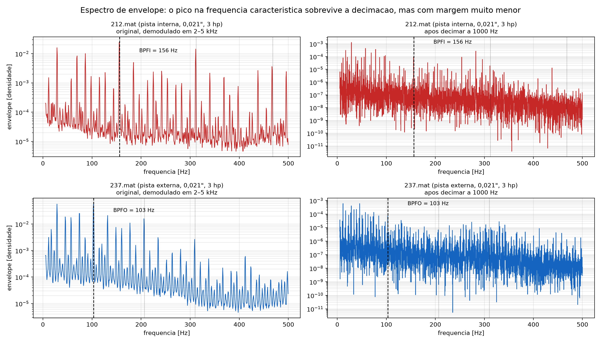
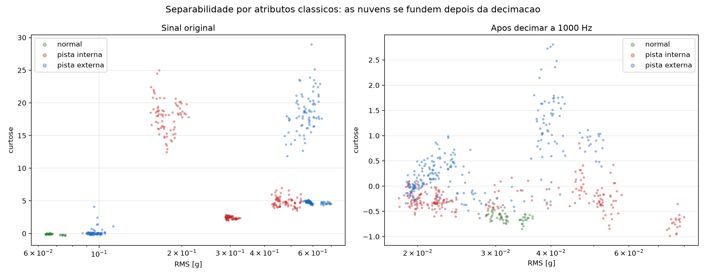

# Engenharia de Dados — do CWRU bruto ao dataset curado

Gerado por `python -m dataset_engineering.executar` em 19/08/2026 20:43.

Este relatório é gerado, não escrito à mão. Todo número aqui sai de uma
execução das quatro etapas do fluxo sobre os arquivos em `data/`.

---

## Resumo

| Medida | Antes | Depois | Δ |
|---|---|---|---|
| Ensaios | 28 | 24 | -4 |
| Sinal a 1000 Hz | 279.4 s | 238.7 s | -40.6 s |
| Janelas independentes | 545 | 466 | -79 |
| Ensaios lendo a série errada | 1 | 0 | -1 |
| Ensaios sem assinatura observável | 4 | 0 | -4 |
| **Separabilidade** (sonda linear) | **84.02%** | **89.04%** | **+5.02 pp** |
| Desvio entre cargas | 9.25% | 8.02% | -1.24 pp |
| Falso alarme | 28.95% | 25.00% | -3.95 pp |

> A **sonda linear** é uma regressão logística sobre atributos rasos
> (RMS, curtose, assimetria, fator de crista, taxa de cruzamento por zero
> e energia em 8 sub-bandas), validada deixando uma carga de fora. Ela não
> é o modelo do projeto: é um termômetro barato e determinístico da
> separabilidade do dado. Serve para comparar conjuntos, não para prever
> a acurácia da CNN.

---

## 1. O dataset bruto

28 ensaios do CWRU Bearing Data Center, rolamento
SKF 6205-2RS JEM no lado do acionamento, defeitos usinados por
eletroerosão. Cada `.mat` é um ensaio: uma classe, uma severidade e um
nível de carga.

| Classe | Severidades | Cargas | Taxa original |
|---|---|---|---|
| Normal | — | 0–3 hp | 48000 Hz |
| Pista interna | 0,007" / 0,014" / 0,021" | 0–3 hp | 12000 Hz |
| Pista externa | 0,007" / 0,014" / 0,021" | 0–3 hp | 12000 Hz |

Figuras em [`figuras/`](figuras/):

### O sinal, antes e depois da decimação


### Onde mora a energia


A faixa laranja é a ressonância estrutural do mancal (2–5 kHz), excitada
pelos impactos do defeito. A área cinza é tudo que o filtro
anti-aliasing descarta ao decimar para 1000 Hz.

### A assinatura do defeito


### Separabilidade por atributos clássicos


---

## 2. Diagnóstico — o que estava errado

### 2.1 Leitura do canal errado

`DataProcessor.load_mat_file()` escolhe a **primeira** chave que
contém `_DE_time`. Alguns arquivos do CWRU carregam as variáveis de
mais de um ensaio, e nesses a primeira chave não é a do ensaio certo.

| Arquivo | Lia | Deveria ler | Consequência |
|---|---|---|---|
| `99.mat` | `X098_DE_time` | `X099_DE_time` | série de outra carga, rotulada como 2 hp |

### 2.2 Ensaios sem assinatura observável

Razão pico/mediana do espectro de envelope na frequência
característica, medida no sinal **original** demodulado em 
2–5 kHz. Piso de ruído: 10.

| Arquivo | Classe | Severidade | Carga | Razão |
|---|---|---|---|---|
| `197.mat` | pista externa | 0,014" | 0 hp | **5.6** |
| `198.mat` | pista externa | 0,014" | 1 hp | **6.7** |
| `199.mat` | pista externa | 0,014" | 2 hp | **6.8** |
| `200.mat` | pista externa | 0,014" | 3 hp | **3.0** |

Para comparação, os demais ensaios da mesma classe ficam entre
1.000 e 40.000. O defeito existe na bancada, mas não se manifesta no
sinal — nem antes de qualquer decimação. Mantidos, seriam rótulos de
falha que nenhum sensor poderia sustentar.

---

## 3. Tratativas aplicadas

| # | Tratativa | Efeito |
|---|---|---|
| T1 | Selecionar o canal pelo **número do arquivo**, não pela ordem das chaves | 1 ensaio(s) corrigido(s) |
| T2 | Inventário obrigatório: a curadoria para se faltar arquivo | impede treinar em silêncio com dataset incompleto |
| T3 | Deduplicação por hash da série | efeito colateral de T1: os duplicados somem |
| T9 | Quarentena por **observabilidade medida** | 4 ensaio(s) em quarentena |

T9 é um critério, não uma lista negra: qualquer ensaio cuja frequência
característica não se destaque do ruído é reprovado, inclusive arquivos
que o CWRU venha a publicar depois.

---

## 4. Ablação — qual tratativa produziu o quê

| Conjunto | Ensaios | Janelas indep. | Acurácia | Desvio | Detecção | Falso alarme |
|---|---|---|---|---|---|---|
| bruto (como o `build.py` lê hoje) | 28 | 545 | 84.02% | 9.25% | 95.61% | 28.95% |
| + T1 (canal corrigido) | 28 | 545 | 84.58% | 9.76% | 95.40% | 25.00% |
| **+ T1 + T9 (curado)** | 24 | 466 | 89.04% | 8.02% | 94.47% | 25.00% |

### Acurácia por carga deixada de fora

| Conjunto | 0 hp | 1 hp | 2 hp | 3 hp |
|---|---|---|---|---|
| bruto (como o `build.py` lê hoje) | 69.11% | 83.46% | 91.73% | 91.79% |
| + T1 (canal corrigido) | 69.11% | 83.46% | 91.73% | 94.03% |
| **+ T1 + T9 (curado)** | 79.81% | 82.46% | 98.25% | 95.65% |

O ganho vem quase todo de **T9**: remover quatro ensaios cujo rótulo o
sinal não sustenta melhora a separabilidade mais do que os mesmos quatro
ensaios acrescentavam. T1 corrige a **correção** dos rótulos — vale por
si, independentemente de mexer pouco na sonda.

---

## 5. O dataset curado

```
data_curado/
  manifesto.json          metadados dos 28 ensaios, incluídos e em quarentena
  0_normal/097.npy        série já decimada para 1 kHz, float32
  1_inner_race/105.npy
  ...
```

| Item | Valor |
|---|---|
| Ensaios incluídos | 24 |
| Ensaios em quarentena | 4 |
| Taxa de amostragem | 1000 Hz |
| Sinal total | 238.7 s |
| Janelas independentes | 466 |

| Classe | Ensaios | Janelas indep. | % |
|---|---|---|---|
| `0_normal` | 4 | 69 | 14.8% |
| `1_inner_race` | 12 | 238 | 51.1% |
| `2_outer_race` | 8 | 159 | 34.1% |

A série é gravada **já decimada**. A decimação é determinística e cara;
guardá-la uma vez faz o `build.py`, o `validacao_por_carga.py` e este
fluxo partirem do mesmo sinal, byte a byte. Antes, cada ferramenta
decimava por conta própria.

O `manifesto.json` carrega classe, severidade, carga e rpm de cada
ensaio. Isso elimina os mapas `arquivo -> carga` que estavam duplicados
em três arquivos do projeto, e habilita validações estratificadas
(deixando uma carga de fora, deixando uma severidade de fora) sem
hard-coding.

### Amostras inspecionáveis

O `.mat` do CWRU não abre em planilha nem em editor de texto. Cinco CSVs
pequenos, em [`../amostras/`](../amostras/LEIA-ME.md), expõem o dataset
antes e depois da curadoria — do catálogo dos 28 ensaios à janela de 512
amostras que entra na rede, e às duas séries que `99.mat` pode entregar
lado a lado. São versionados no repositório.

---

## 6. O que isto NÃO resolve

A curadoria conserta rótulos e integridade. Ela não mexe no limite
físico, que continua sendo o fator dominante:

| | |
|---|---|
| Energia descartada pela decimação (falhas) | **~98%** |
| Curtose da pista interna, original → 1000 Hz | +8,4 → −0,3 |
| Faixa de RMS da classe normal | **dentro** da faixa das falhas |

O MPU6050 não passa de 1 kHz; a assinatura do defeito é excitada em
2–5 kHz. O que sobrevive é a **periodicidade** dos impactos, não a
energia deles. Ver [`../../docs/dataset.md`](../../docs/dataset.md) §4 e §5.

---

## Reproduzir

```bash
python download_cwru.py                        # 28 arquivos, idempotente
python -m dataset_engineering.executar         # as quatro etapas
```
