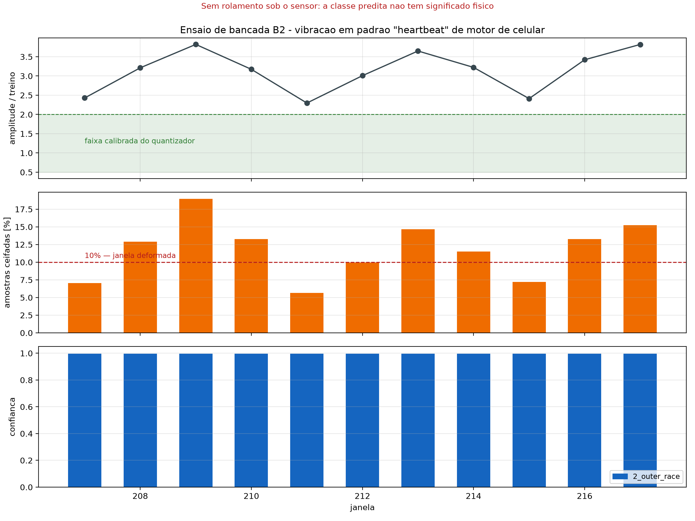

# Ensaios de Bancada — excitação por motor de celular

Dois ensaios com o sensor excitado por um celular vibrando, sem rolamento
algum. Reproduzíveis com:

```bash
python tools/analise_bancada.py relatorios/bancada/*.txt
```

| Ensaio | Excitação | Janelas | Captura |
|---|---|---|---|
| **B1** | vibração contínua | 7 (#186–#192) | [`vibracao_continua.txt`](../relatorios/bancada/vibracao_continua.txt) |
| **B2** | vibração pulsada (*heartbeat*) | 11 (#207–#217) | [`vibracao_heartbeat.txt`](../relatorios/bancada/vibracao_heartbeat.txt) |

---

## 1. O que estes ensaios não são

> **Nenhuma classe predita aqui tem significado físico.** Não há rolamento sob o
> sensor. As classes do modelo são definidas por frequências de passagem de
> esfera — BPFI ≈ 156–162 Hz, BPFO ≈ 103–107 Hz — que **só existem quando há um
> eixo girando sob carga**. Um motor de celular não produz nenhuma delas.

Isso é o ensaio **V3** do [protocolo de validação](protocolo_validacao.md), e
ele continua fora do escopo: exigiria uma bancada rotativa.

O que estes ensaios medem é outra coisa, e ela não aparece em nenhuma matriz de
confusão: **o que o sistema faz quando a entrada está fora da distribuição de
treino.** Num sistema de manutenção preditiva real, essa é a condição mais
frequente — a máquina passa a maior parte do tempo em estados que o dataset não
cobre.

---

## 2. A cadeia de aquisição, sob vibração real

Somando os dois ensaios: **18 janelas, 9.216 amostras.**

| Métrica | Critério | B1 | B2 |
|---|---|---|---|
| `fs` real | ±1% de 1000 Hz | 999,5 Hz ✅ | 999,5 Hz ✅ |
| Jitter máximo | < 5% do intervalo (50 µs) | 9 µs ✅ | 9 µs ✅ |
| Amostras repetidas | 0 | 0 / 3.584 ✅ | 0 / 5.632 ✅ |
| Saturações do sensor | 0 | 0 ✅ | 0 ✅ |
| Erros de I2C | 0 | 0 ✅ | 0 ✅ |
| Atrasos de laço | 0 | 0 ✅ | 0 ✅ |

O ensaio V1 do protocolo já tinha aprovado a aquisição, mas com uma excitação
breve e controlada. Aqui ela é sustentada por dezenas de segundos, com
amplitudes de até 4x a do treino, e **não houve uma única amostra perdida,
repetida ou saturada**. O jitter de 9 µs é 0,9% do intervalo de amostragem.

### Piso de ruído do sensor

A janela **#190 do B1** capturou o motor desligado — o sensor praticamente em
repouso:

| Eixo | Desvio padrão |
|---|---|
| X | 3,38 mg |
| Y | 3,27 mg |
| Z | 5,19 mg |

Esse é um **limite superior** do piso de ruído do MPU6050 a 1 kHz (pode conter
vibração residual do ambiente). Comparado com o desvio do sinal de treino:

| | Valor |
|---|---|
| Desvio do sinal de treino (CWRU decimado) | 34,57 mg |
| Piso de ruído medido (eixo Z) | ≤ 5,19 mg |
| **Relação sinal/ruído** | **≈ 6,7 : 1 (≈ 16,5 dB)** |

**Este número merece entrar no TCC.** Depois da decimação para 1 kHz, o sinal do
CWRU tem apenas ~6,7x a amplitude do ruído próprio do sensor. Para os ensaios de
falha mais fracos — os de 0,014" na pista externa, que a curadoria colocou em
quarentena por não terem assinatura — a margem seria ainda menor. É mais uma
evidência quantitativa a favor de trocar o MPU6050 por um acelerômetro de banda
larga e menor ruído.

---

## 3. O modelo não tem estado de "não sei"

**Das 18 janelas, 18 saíram com confiança 0,9961** — que é o valor máximo
representável, `int8 = 127`. Não houve uma única saída intermediária.

O caso decisivo é a **janela #190 do B1**:

| | |
|---|---|
| Desvio padrão do eixo Z | **0,0052 g** (0,15x o treino) |
| Níveis int8 distintos | **20 de 256** |
| Amostras ceifadas | 0 |
| **Predição** | **`2_outer_race` com 99,6% de confiança** |

O motor estava desligado. O sensor lia o próprio ruído. E o modelo diagnosticou
**falha na pista externa com confiança máxima**.

> Este é o resultado mais importante dos dois ensaios. Um classificador softmax
> de três saídas, sem classe de rejeição, **é obrigado a escolher uma das três**
> — mesmo diante de ruído. A confiança de 99,6% não mede certeza: mede apenas
> que um dos logitos ficou bem acima dos outros dois, o que a normalização
> estatística garante que aconteça para praticamente qualquer entrada.
>
> Num sistema de manutenção preditiva em campo, isso é uma falha de projeto, não
> um detalhe. A máquina parada seria diagnosticada como defeituosa.

O firmware **já detecta** a condição — imprime `razao=0.150x`, fora da faixa
calibrada — mas o aviso é textual e não altera a saída. A predição é publicada
com a mesma autoridade de uma janela válida.

---

## 4. A classe predita segue o ceifamento, não o sinal

No B1 a amplitude cresce de forma monotônica enquanto o motor acelera:

| Janela | Razão | Ceifamento | Classe |
|---|---|---|---|
| #186 | 3,60x | 1,0% | `2_outer_race` |
| #187 | 3,63x | 0,8% | `2_outer_race` |
| #188 | 3,75x | 4,3% | `2_outer_race` |
| #189 | 3,88x | 9,8% | `2_outer_race` |
| #191 | 4,06x | **13,5%** | **`1_inner_race`** |
| #192 | 4,20x | **15,6%** | **`1_inner_race`** |

A fonte de excitação é a mesma o tempo todo. O que muda entre #189 e #191 não é
o conteúdo do sinal — é que o quantizador passou a achatar 13% das amostras em
vez de 10%. **A troca de classe é um artefato do ceifamento**, e acompanha a
fronteira dos 10% quase exatamente.

Isso confirma, no hardware, o que o aviso do firmware já dizia: acima de ~10% de
ceifamento a janela chega deformada e a classe predita não carrega informação.

---

## 5. A aquisição captura a modulação; o classificador é cega a ela

O B2 usou vibração pulsada. O desvio padrão do eixo Z oscila entre 0,0794 g e
0,1320 g — uma variação de 66% — e a oscilação é **periódica**:

```
autocorrelação:  k=1: +0,00   k=2: −0,77   k=3: +0,02   k=4: +0,61
```

O `k=2` fortemente negativo (antifase) e o `k=4` positivo (em fase) dão um
período limpo de **4 janelas**. A envoltória do padrão *heartbeat* foi
integralmente capturada pela cadeia de aquisição.



**E a saída do classificador é uma linha reta.** Onze janelas, onze vezes
`2_outer_race` a 99,6%. O painel de cima mostra a modulação; o de baixo, um muro
de barras idênticas.

> A informação está no sinal e chega ao microcontrolador intacta. O que a
> descarta é o modelo — treinado para separar três assinaturas espectrais
> específicas, ele não tem nenhum mecanismo para representar "amplitude variando
> no tempo". Separar essas duas coisas é o que estes ensaios permitem afirmar
> com dados.

---

## 6. Achados secundários

### 6.1 Erro de calibração de +15,6%

Em repouso, o módulo do vetor de gravidade lê **1,1556 g** em vez de 1,0000 g,
consistente nas 18 janelas dos dois ensaios (mín. 1,1548, máx. 1,1565).

O módulo **não depende da orientação** — inclinar o sensor redistribui a
gravidade entre os eixos mas preserva o módulo. Portanto isto é calibração, não
montagem. Duas causas possíveis:

| Causa | Efeito nos desvios padrão | Teste: virar a placa 180° |
|---|---|---|
| Erro de **sensibilidade** (escala) | infla todos em 15,6% | Z leria ≈ **−1,156 g** |
| **Offset** de zero-g no eixo Z | nenhum (a constante some na subtração da média) | Z leria ≈ **−0,844 g** |

É um ensaio de trinta segundos e vale fazer. Se for erro de escala, todas as
razões de amplitude deste documento estão infladas em 15,6% — a de 4,20x seria
3,63x, e a de 0,15x seria 0,13x. **A conclusão não muda**: nenhuma janela dos
dois ensaios cai dentro da faixa calibrada de 0,5x a 2,0x em nenhuma das duas
hipóteses.

### 6.2 O eixo alimentado ao modelo não é o eixo dominante

No B2, o eixo **X** vibra mais que o Z:

| Ensaio | dp X | dp Z | Eixo enviado ao modelo |
|---|---|---|---|
| B1 | 0,036–0,041 g | 0,124–0,145 g | Z ✅ (é o dominante) |
| B2 | **0,132–0,212 g** | 0,079–0,132 g | Z ❌ (X é o dominante) |

O acoplamento mecânico entre o celular e o suporte mudou entre os ensaios. O
firmware tem os comandos `x`, `y`, `z` e `m` (módulo) justamente para isso —
vale repetir o B2 com `x` e comparar. Numa instalação real, a escolha do eixo
tem de seguir a direção de carga do mancal, e não o padrão do firmware.

---

## 7. O que estes ensaios acrescentam ao TCC

1. **A aquisição está validada sob vibração real e sustentada**, não só sob
   excitação breve: 9.216 amostras sem uma perda, com jitter de 0,9%.
2. **O SNR de ~6,7:1 contra o piso de ruído do sensor** é um argumento
   quantitativo novo — e independente da análise espectral — para a limitação do
   MPU6050.
3. **A ausência de estado de rejeição é uma limitação de projeto documentada com
   evidência**, não uma ressalva teórica: sensor em repouso → falha na pista
   externa a 99,6%.
4. **O ceifamento governa a classe predita** acima de ~10%, medido no hardware.
5. **A separação entre "o sensor captura" e "o modelo aproveita"** fica
   demonstrada: a modulação de período 4 está no dado e ausente na saída.

### Encaminhamentos sugeridos

| # | Ação | Custo |
|---|---|---|
| B-1 | **Suprimir a predição** quando `razao` sai da faixa 0,5x–2,0x ou o ceifamento passa de 10%, publicando `indeterminado` em vez de uma classe | baixo, só firmware |
| B-2 | Adicionar um **limiar de rejeição** na softmax, ou uma quarta classe "outro", treinada com ruído e vibração genérica | médio, muda o modelo |
| B-3 | Virar a placa 180° e reler Z para separar offset de erro de escala | trinta segundos |
| B-4 | Repetir o B2 com o eixo `x` e com o módulo `m` | minutos |
| B-5 | Capturar uma janela com o comando `r` e calcular a FFT, para caracterizar o espectro do motor de celular | minutos |

O **B-5** é o que falta para fechar a análise: hoje só temos estatísticas
agregadas por janela. Com a forma de onda bruta dava para verificar em que
frequência o motor excita, se há harmônicos dentro da banda de 0–500 Hz e o
quanto disso se parece com uma assinatura de rolamento — que é a explicação
provável para o modelo preferir `2_outer_race` de forma tão consistente.

---

## Ver também

- [`protocolo_validacao.md`](protocolo_validacao.md) — os ensaios V1–V4
- [`dataset.md`](dataset.md) — por que 1 kHz é a limitação dominante
- [`comparativo_curadoria.md`](comparativo_curadoria.md) — o sistema com e sem curadoria
- `tools/analise_bancada.py` — o parser que gera todos os números acima
