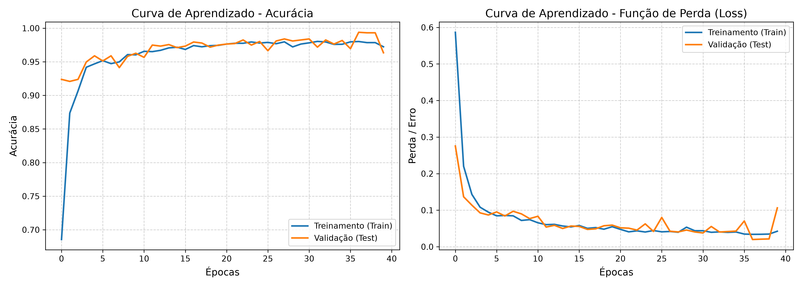
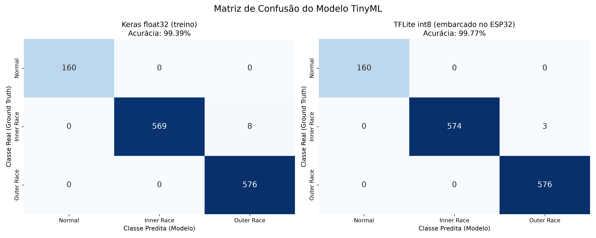

# 📈 Relatório de Desempenho, Gráficos e Consumo (TinyML)

## 1. Visualização do Modelo (Gráficos exportados para o TCC)
As imagens abaixo foram geradas fisicamente em alta resolução (300 DPI) e salvas na pasta raiz de artefatos. Use-as para comprovar o aprendizado do seu modelo sem *overfitting*.

### 📊 Histórico de Treinamento (Curva de Aprendizado)
Este gráfico valida o aprendizado das extrações de frequência ao longo do tempo.


### 🎯 Matriz de Confusão Visual
Mapeamento termográfico exato de onde o modelo classificou corretamente ou sofreu Falsos Positivos/Negativos, antes e depois da quantização.


---

## 1.1 Escala do Conjunto de Dados

| Item | Valor |
|---|---|
| Arquivos `.mat` do CWRU | 28 |
| Sinal após decimação | 279.4 s a 1000 Hz |
| Janelas de treino | 6104 |
| Janelas de teste | 1313 |
| **Janelas independentes** (sem sobreposição) | **545** |

✅ Amostra adequada. As janelas de treino e teste usam sobreposição de
93.75%, o que multiplica a contagem sem criar
informação nova. O corte treino/teste é feito por trecho temporal contíguo,
antes do janelamento, com uma zona morta de uma janela inteira — nenhuma amostra
aparece dos dois lados.

---

## 2. Métricas Analíticas

O modelo gravado no ESP32 é o **quantizado em int8**, não o Keras em float32. As
duas acurácias aparecem abaixo porque só a diferença entre elas revela o custo
real da conversão.

| Modelo | Acurácia | Papel |
|---|---|---|
| Keras float32 | `99.39%` | referência de projeto (não embarcável) |
| **TFLite int8** | **`99.77%`** | **é este o número a citar para o ESP32** |

* **Custo da quantização:** `+0.38 pp` — 5 de 1313 janelas mudaram de classe.
* Kernels de referência (`BUILTIN_REF`), que são os que o TensorFlow Lite Micro implementa.

> ⚠️ **Como ler esta acurácia.** A divisão treino/teste é temporal *dentro de cada
> arquivo*: os primeiros 80% de cada gravação vão para o treino e os últimos 20%
> para o teste. Não há vazamento de amostras — existe uma zona morta de uma janela
> inteira na fronteira — mas **toda janela de teste tem uma contraparte de treino
> da mesma gravação**: mesmo rolamento, mesmo defeito, mesma carga, mesma montagem.
> O número acima mede consistência dentro da condição de operação, não
> generalização para uma condição nova.
>
> Para a medida de generalização, execute `python tools/validacao_por_carga.py`,
> que treina em três níveis de carga e testa no quarto. Reporte os dois números no
> TCC: este é o limite superior, aquele é o realista.

**Precisão e Recall — TFLite int8 (modelo embarcado):**
```text
              precision    recall  f1-score   support

           0       1.00      1.00      1.00       160
           1       1.00      0.99      1.00       577
           2       0.99      1.00      1.00       576

    accuracy                           1.00      1313
   macro avg       1.00      1.00      1.00      1313
weighted avg       1.00      1.00      1.00      1313

```

**Precisão e Recall — Keras float32 (antes da quantização):**
```text
              precision    recall  f1-score   support

           0       1.00      1.00      1.00       160
           1       1.00      0.99      0.99       577
           2       0.99      1.00      0.99       576

    accuracy                           0.99      1313
   macro avg       1.00      1.00      1.00      1313
weighted avg       0.99      0.99      0.99      1313

```

---

## 3. Limites de Hardware Comprovados (Memória do ESP32)

* 💽 **Consumo de Memória Flash (ROM):** `15.24 KB`
  * *Parecer Técnico:* ✅ Ideal (Menor que 1 MB. Sobra espaço para OTA e WebServer no ESP32).

* 🧠 **Pico de Memória RAM Volátil (Tensor Arena / SRAM):** `~2.00 KB`
  * *Parecer Técnico:* ✅ Ideal (O modelo não esgota os ~320 KB estáticos da controladora).

* ⚡ **Performance Estimada de Processamento:**
  * O arquivo C gerado contém instruções Integer de 8 bits (Int8). Carga desprezível para a arquitetura RISC/Xtensa do microcontrolador sem uso de co-processador matemático FPU.
